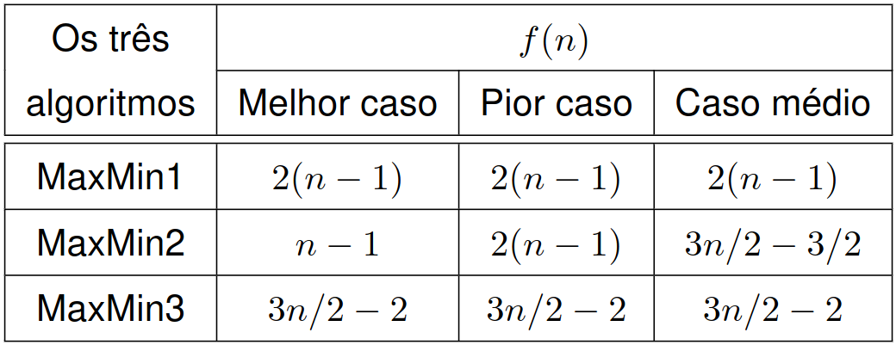
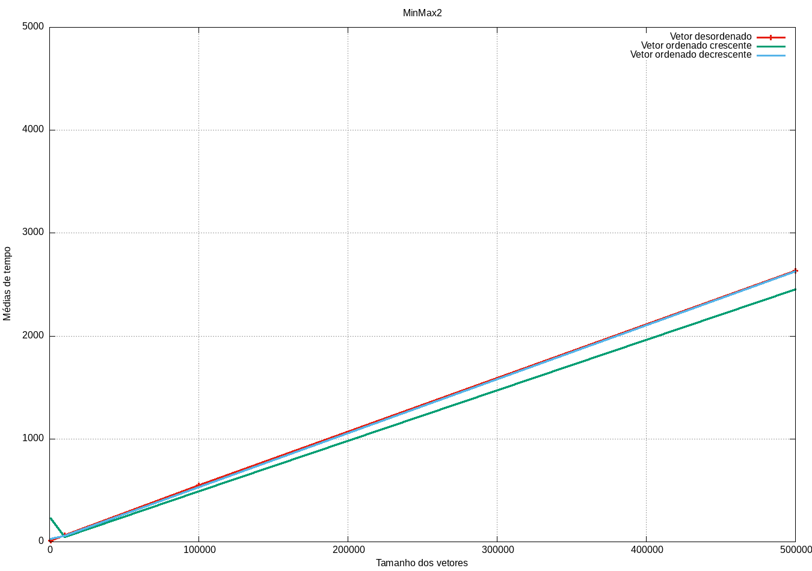
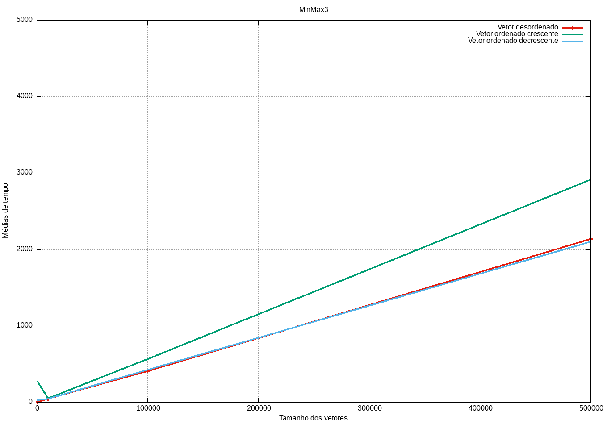

<div align="center">
    
</div>

<div align="center">

# 🪐 MinMax

</div>

## ☕ Introdução

Este trabalho foi proposto pelo professor [Michel Pires Silva](https://github.com/mpiress), da matéria Algoritmos e Estrutura de Dados I, do Centro Federal de Educação Tecnológica de Minas Gerais (CEFET - MG), Campus V - Divinópolis.

A eficiência dos algoritmos é fundamental para o desempenho de sistemas computacionais, especialmente em contextos onde grandes volumes de dados são processados. A busca por algoritmos mais rápidos e eficientes envolve a análise detalhada de seu comportamento frente a diferentes tamanhos de entrada. A análise assintótica, frequentemente referida como "análise de complexidade Big O (𝑂)", é uma ferramenta amplamente utilizada para medir o crescimento do tempo de execução de um algoritmo conforme o tamanho da entrada, 𝑛, aumenta.

Essa técnica de análise nos permite estimar o comportamento do algoritmo a longo prazo, quando 𝑛 tende ao infinito, oferecendo uma perspectiva clara sobre sua escalabilidade. No entanto, é importante notar que a análise assintótica considera apenas a quantidade de interações do algoritmo com os dados, sem levar em conta variações no hardware ou em outros fatores de implementação que podem afetar o desempenho real em termos de tempo de execução. Assim, mesmo que dois algoritmos apresentem a mesma complexidade, seu desempenho prático pode variar em determinadas situações.

Neste projeto, investigamos três variações do algoritmo MinMax, criado pelo professor Nívio Ziviani, da Universidade Federal de Minas Gerais (UFMG). Esses algoritmos têm como objetivo encontrar simultaneamente o menor e o maior valor em um conjunto de dados, e cada variação – MinMax 1, MinMax 2 e MinMax 3 – adota diferentes abordagens para essa busca, resultando em diferentes custos computacionais. Ao longo deste trabalho, buscamos não apenas explicar o funcionamento detalhado de cada variação, mas também comparar seu comportamento em termos de complexidade computacional, utilizando a análise assintótica como base. Para além da teoria, apresentaremos os resultados de testes empíricos, que ilustram o desempenho prático de cada algoritmo em diferentes cenários.
   
## 💡 Príncipios Teóricos

Nesta seção, abordaremos os 3 algoritmos propostos, analisando seu funcionamento e custo computacional em diferentes casos. Na figura abaixo temos os valores das funções `f(n)` para cada cada um dos algortimos em cada um dos casos - melhor, médio e pior.



Como pode-se observar ao analisar a imagem, embora todos os algoritmos tenham custo linear, ou seja, \(O(n)\), é possível notar algumas diferenças, mesmo que pequenas, nas constantes que influenciam seu desempenho. Isso significa que, em valores muito grandes de \(n\), eles podem acabar se comportando de maneira semelhante, desde que as entradas estejam ordenadas de forma a não impactar tanto.

### MinMax 1

 ```cpp

void MaxMin1(std::vector<int>& A, int& Max, int& Min) {
    Max = A[0], Min = A[0];
    for(int i = 1; i < A.size(); i++) {
        if(A[i] > Max) Max = A[i];
        if(A[i] < Min) Min = A[i];
    }
}
```


A função `MaxMin1` percorre um vetor de inteiros `A` e encontra o valor máximo e mínimo de forma linear. O processo começa inicializando as variáveis `Max` e `Min` com o primeiro elemento do vetor. Em seguida, um laço percorre o vetor a partir do segundo elemento, comparando cada valor com `Max` e `Min`, atualizando-os se um elemento maior ou menor for encontrado, respectivamente. 

O número exato de comparações realizadas é \(2(n-1)\), pois para cada um dos \(n-1\) elementos restantes são feitas duas comparações (uma para o máximo e outra para o mínimo). No entanto, o custo computacional assintótico é \(O(n)\), já que o fator constante não altera o crescimento com grandes valores de \(n\).

### MinMax 2

```cpp

void MaxMin2(std::vector<int>& A, int& Max, int& Min) {
    Max = A[0], Min = A[0];
    for(int i = 1; i < A.size(); i++) {
        if(A[i] > Max) Max = A[i];
        else if(A[i] < Min) Min = A[i];
    }
}
```

A função `MaxMin2` percorre um vetor de inteiros `A` para encontrar os valores máximo e mínimo de forma similar à função `MaxMin1`, mas com uma pequena otimização. As variáveis `Max` e `Min` são inicializadas com o primeiro elemento do vetor. Em seguida, o laço percorre o vetor a partir do segundo elemento. Para cada elemento, se ele for maior que o valor atual de `Max`, a variável é atualizada; caso contrário, uma única comparação adicional é feita para verificar se o elemento é menor que `Min`. A seguir, vamos destrinchar cada um dos casos do algoritmo e seu custo.

### Melhor caso
Ocorre quando o vetor está ordenado em ordem decrescente. Neste caso, todos os elementos seguintes ao primeiro serão menores que ele. Assim, apenas uma comparação será necessária por iteração, já que a condição `if (A[i] > Max)` sempre falhará, mas `else if (A[i] < Min)` será verdadeiro. Dessa forma, o melhor caso realiza \(n-1\) comparações.

### Pior caso
O pior caso acontece quando o vetor está ordenado em ordem crescente. Aqui, todos os elementos subsequentes ao primeiro serão maiores que o primeiro valor, o que força o programa a realizar as duas comparações em todas as iterações, ou seja, tanto `if (A[i] > Max)` quanto `else if (A[i] < Min)` serão executados. Nesse cenário, o número total de comparações será \(2(n-1)\), similar ao algoritmo `MaxMin1`.

### Caso médio
Em um cenário com dados aleatórios, o comportamento médio resultará em aproximadamente uma comparação e meia por iteração. Isso ocorre porque, em média, metade das vezes o valor comparado será maior que `Max` e a outra metade será menor que `Min`. Portanto, o número médio de comparações será \( \frac{3}{2} \) comparações.
    
Mesmo com essas variações no número de comparações, a complexidade assintótica da função permanece \(O(n)\) em todos os casos, já que o crescimento do número de comparações é linear com o tamanho do vetor.

### MinMax 3

```cpp

void MaxMin3(std::vector<int>& A, int& Max, int& Min) {
    int FimDoAnel;
    if (A.size() % 2 > 0) {
        A.push_back(A.back());
        FimDoAnel = A.size() - 1;
    } else {
        FimDoAnel = A.size() - 2;
    }

    if (A[0] > A[1]) {
        Max = A[0];
        Min = A[1];
    } else {
        Max = A[1];
        Min = A[0];
    }

    int i = 2;
    while (i <= FimDoAnel) {
        if (A[i] > A[i+1]) {
            if (A[i] > Max) Max = A[i];
            if (A[i+1] < Min) Min = A[i+1];
        } else {
            if (A[i+1] > Max) Max = A[i+1];
            if (A[i] < Min) Min = A[i];
        }
        i += 2;
    }
}
```

A função MaxMin3 é projetada para encontrar os valores máximo e mínimo em um vetor de inteiros A de forma eficiente. Ela começa verificando se o número de elementos é ímpar e, se for o caso, duplica o último elemento para tornar o número total de elementos par. Em seguida, inicializa Max e Min com base na comparação dos dois primeiros elementos. O laço principal percorre o vetor em pares, comparando os dois elementos de cada par e atualizando Max e Min conforme necessário.

### Melhor caso

O melhor caso ocorre quando os elementos do vetor são organizados de forma que o laço consegue identificar rapidamente os valores máximo e mínimo em cada par. Neste cenário, a função realiza apenas uma comparação por iteração do laço. Como o laço percorre o vetor em pares, o número de comparações é aproximadamente \( \frac{n}{2} \), resultando em \( \frac{n}{2} \) comparações no total.

### Pior caso

O pior caso acontece quando os pares de elementos estão dispostos de forma que todas as comparações possíveis são necessárias. Nesse cenário, a função realiza duas comparações por iteração, resultando em um total de \( n \) comparações, pois o laço percorre \( \frac{n}{2} \) pares e realiza duas comparações por par.

### Caso médio

Em um cenário com dados aleatórios, a função realiza comparações para aproximadamente metade dos elementos, com uma média de duas comparações por iteração. Assim, o número médio de comparações é cerca de \( n \), já que o laço percorre o vetor em pares e realiza comparações para ambos os elementos de cada par.

Assim como nos anteriores, mesmo com essas variações no número de comparações, a complexidade assintótica da função permanece \( O(n) \) em todos os casos, já que o crescimento do número de comparações é linear com o tamanho do vetor.

## 🎯 Objetivos

- Analisar o custo computacional dos algoritmos MinMax 1, MinMax 2 e MinMax 3.
- Descrever o funcionamento de cada algoritmo e suas diferenças.
- Aplicar testes para avaliar o desempenho dos algoritmos em cenários variados.
- Demonstrar os resultados dos testes e suas implicações para a escolha do algoritmo mais eficiente.

## 📂 Organização dos Arquivos no Diretório
Os arquivos criados para o funcionamento do projeto estão dispostos da seguinte maneira do diretório:

markdown
- - `/TrabalhoMaxMin`: Diretório raiz do projeto.
  - `/build`: Diretório gerado ao usar o Makefile.
  - `/img`: Diretório para imagens. Contém o logo do projeto e prints do código.
  - `/src`: Diretório para o código fonte.
    - `GerarVetores.cpp`: Arquivo para gerar os vetores aleatórios para os testes.
    - `GerarVetores.cpp`: Arquivo de cabeçalho do GerarVetores.cpp.
    - `MinMax.cpp`: Arquivo com a implementação de cada um dos algoritmos MinMax.
    - `MinMax.cpp`: Arquivo de cabeçalho do MinMax.cpp.
    - `Testes.cpp`: Arquivo com a função que realiza os testes de acordo com as regras dadas.
    - `Testes.hpp`: Arquivo de cabeçalho do Testes.cpp.
    - `main.cpp`: Arquivo principal do projeto em C++.
  - `README.md`: Este arquivo.
  - `Makefile`: Makefile para compilar o projeto.
  
## Implementação

### Bibliotecas Utilizadas

- `<iostream>`: biblioteca utilizada para a habilitação de entradas e saídas.
- `<algorithm>`: biblioteca utilizada para funções de ordenação (`std::sort`).
- `<chrono>`: biblioteca utilizada para medir o tempo de execução das funções.
- `<fstream>`: biblioteca utilizada para manipulação de arquivos (`std::ofstream`).
- `<vector>`: biblioteca utilizada para a estrutura de dados `std::vector`.
- `<random>`: biblioteca utilizada para gerar números aleatórios (`std::random_device`, `std::mt19937`, `std::uniform_int_distribution`).
- `"MaxMin.cpp"`: biblioteca utilizada para armazenar a implementação dos algoritmos MinMax.
- `"GerarVetores.cpp"`: biblioteca utilizada para gerar os vetores a serem utilizados nos testes dos algoritmos.
- `"Testes.cpp"`: biblioteca utilizada para realizar os testes com os algortimos.

### Funções

- **MaxMin1**: Esta função recebe um vetor de inteiros e encontra o valor máximo e mínimo no vetor. Ela percorre o vetor uma vez, comparando cada elemento com os valores atuais de máximo e mínimo.

- **MaxMin2**: Similar à função MaxMin1, esta função também encontra o valor máximo e mínimo em um vetor de inteiros. A diferença é que ela usa uma estrutura de controle `else if` para evitar comparações desnecessárias.

- **MaxMin3**: Esta função encontra o valor máximo e mínimo em um vetor de inteiros, mas faz isso em pares de elementos. Se o vetor tiver um número ímpar de elementos, o último elemento é duplicado temporariamente para facilitar a comparação em pares.

- **executarTestes**: Esta função executa testes de desempenho nas funções MaxMin1, MaxMin2 e MaxMin3. Ela gera vetores aleatórios de diferentes tamanhos, ordena-os em diferentes estados (aleatório, crescente, decrescente) e mede o tempo de execução médio de cada função em cada estado. Os resultados são salvos em arquivos de saída.

- **gerarVetorAleatorio**: Esta função gera um vetor de inteiros aleatórios de um tamanho especificado, sendo os possíveis valores para esse tamanho 1000, 10000, 100000 e 500000. Os valores dos inteiros são distribuídos uniformemente entre 0 e 1000.

### Variáveis Inicializadas

Antes de iniciar os testes, várias variáveis são criadas e/ou inicializadas:

- **vetores**: Um array de vetores de inteiros, cada um com um tamanho diferente (1000, 10000, 100000, 500000).
- **max, min**: Variáveis inteiras utilizadas para armazenar os valores máximo e mínimo encontrados pelos algoritmos.
- **file, fileCSV**: Objetos `std::ofstream` utilizados para salvar os resultados dos testes em arquivos de saída (`resultados.mps` e `resultados.csv`).
- **funcoes**: Um vetor de funções que contém as três variações do algoritmo MinMax (`MinMax1`, `MinMax2`, `MinMax3`).
- **estados**: Um vetor de strings que representa os diferentes estados dos vetores (aleatório, crescente, decrescente).
- **nomesFuncoes**: Um vetor de strings que contém os nomes das funções (`"MinMax1"`, `"MinMax2"`, `"MinMax3"`).

Essas variáveis são utilizadas ao longo da execução dos testes para armazenar dados temporários e salvar os resultados finais.

### Script Python

O script em Python lê um arquivo CSV chamado `resultados.csv` e separa seus dados em múltiplos arquivos CSV com base em combinações específicas de colunas. Ele cria um diretório, `PorFuncaoEstado`, para armazenar os arquivos de saída. Para cada linha do arquivo de entrada, o script extrai os valores das colunas "Função", "Vetor" e "Estado". Em seguida, ele cria (se ainda não existirem) e escreve em arquivos CSV separados para cada combinação única de "Função" e "Estado" no diretório `PorFuncaoEstado`. Isso permite organizar os dados de maneira mais granular e específica, facilitando análises posteriores.

### GNUplot

GNUplot é utilizado para gerar gráficos a partir dos resultados dos testes. Os arquivos CSV gerados pelo programa em C++ são utilizados como entrada para o GNUplot, que cria gráficos mostrando o desempenho dos diferentes algoritmos em diferentes cenários. Os gráficos são salvos em arquivos de imagem para análise posterior.

## 🧪 Resultados e Análises 

Nesta seção, apresentaremos os resultados obtidos a partir da execução dos testes com os algoritmos MinMax 1, MinMax 2 e MinMax 3. Espera-se que nosso código identifique corretamente os valores máximo e mínimo em diferentes conjuntos de dados, além de medir o tempo de execução de cada algoritmo em cenários variados (aleatório, crescente e decrescente). A análise dos resultados permitirá avaliar a eficiência e a performance prática de cada variação do algoritmo MinMax. Para garantir a precisão dos resultados, cada algoritmo será executado 10 vezes em cada um dos cenários (aleatório, crescente e decrescente). A média dos tempos de execução será calculada para fornecer uma visão clara da performance de cada algoritmo em diferentes situações. Isso nos permitirá identificar qual algoritmo é mais eficiente em termos de tempo de execução e robustez em diferentes condições de entrada.

### 📄 Arquivos de Saída

Durante a execução dos testes, os resultados são salvos em dois arquivos de saída: `resultados.mps` e `resultados.csv`.

#### `resultados.mps`

Este arquivo contém uma descrição detalhada dos resultados dos testes, incluindo o nome da função, o índice do vetor, os valores máximo e mínimo encontrados, o estado do vetor (aleatório, crescente, decrescente) e o tempo médio de execução em microssegundos. Cada linha do arquivo segue o formato:

```
Função: <nomeFuncao>, Vetor <índice>, Max: <max>, Min: <min>, Tempo médio (<estado>): <tempo_médio> microssegundos
```

#### `resultados.csv`

Este arquivo é um arquivo CSV (Comma-Separated Values) que organiza os resultados dos testes em formato tabular, facilitando a análise e importação para ferramentas de planilhas. A primeira linha do arquivo contém os cabeçalhos das colunas:

```
Função,Vetor,Max,Min,Estado,Tempo Médio
```

Cada linha subsequente representa os resultados de um teste específico, com os valores separados por vírgulas:

```
<nomeFuncao>,<índice>,<max>,<min>,<estado>,<tempo_médio>
```

Esses arquivos são gerados e atualizados durante a execução da função `executarTestes`, garantindo que todos os resultados sejam registrados de forma organizada e acessível para análises posteriores.

### 🐍 Script Python para Separação de Dados

Após executar o código principal, criamos um script em Python para separar os dados por cada função, facilitando a plotagem dos gráficos. Este script lê o arquivo `resultados.csv` e organiza os dados em múltiplos arquivos CSV com base em combinações específicas de colunas, armazenando-os em diretórios apropriados. Isso permite uma análise mais granular e específica dos resultados, auxiliando na visualização e interpretação dos dados através de gráficos.

### 📊 Gráficos

A seguir, apresentamos três gráficos que ilustram o desempenho dos algoritmos MinMax 1, MinMax 2 e MinMax 3 em diferentes cenários. Esses gráficos foram gerados utilizando o GNUplot a partir dos resultados dos testes, com o auxílio de um colega. Agradecimentos especiais ao [Joaquim Cézar](https://github.com/JoaquimCruz) pela colaboração.

#### Gráfico 1: Tempo de Execução Médio MinMax1


A análise do gráfico 1 mostra o tempo de execução médio do algoritmo MinMax1 em diferentes cenários. Observa-se que o tempo de execução aumenta linearmente com o tamanho do vetor, confirmando a complexidade \(O(n)\) do algoritmo. Em vetores ordenados de forma crescente, decrescente ou aleatória, o comportamento do algoritmo permanece consistente, demonstrando sua robustez e eficiência em diferentes condições de entrada. No entanto, é importante notar que, apesar da linearidade, o tempo absoluto de execução pode variar devido a fatores como a constante de tempo associada às operações de comparação e a eficiência do hardware utilizado.

#### Gráfico 2: Tempo de Execução Médio MinMax2



A análise do gráfico 2 mostra o tempo de execução médio do algoritmo MinMax2 em diferentes cenários. Assim como no MinMax1, o tempo de execução do MinMax2 também aumenta linearmente com o tamanho do vetor, confirmando a complexidade \(O(n)\) do algoritmo. No entanto, devido à otimização com a estrutura de controle `else if`, o MinMax2 tende a ser ligeiramente mais eficiente em cenários onde as comparações desnecessárias são evitadas. Em vetores ordenados de forma crescente, decrescente ou aleatória, o comportamento do algoritmo permanece consistente, demonstrando sua robustez e eficiência em diferentes condições de entrada. A diferença de desempenho entre os cenários é mínima, mas perceptível, especialmente em vetores grandes, onde a otimização pode resultar em uma redução significativa no tempo de execução absoluto.


#### Gráfico 3: Tempo de Execução Médio MinMax3



A análise do gráfico 3 mostra o tempo de execução médio do algoritmo MinMax3 em diferentes cenários. Assim como nos algoritmos anteriores, o tempo de execução do MinMax3 aumenta linearmente com o tamanho do vetor, confirmando a complexidade \(O(n)\) do algoritmo. No entanto, devido à abordagem de comparação em pares, o MinMax3 tende a ser mais eficiente em termos de número de comparações realizadas. Em vetores ordenados de forma crescente, decrescente ou aleatória, o comportamento do algoritmo permanece consistente, demonstrando sua robustez e eficiência em diferentes condições de entrada. A diferença de desempenho entre os cenários é mínima, mas perceptível, especialmente em vetores grandes, onde a otimização pode resultar em uma redução significativa no tempo de execução absoluto.


## 👨🏻‍🔬 Ambiente de Teste

O código foi desenvolvido utilizando as seguintes ferramentas:

É importante conhecer o ambiente de teste para garantir a reprodutibilidade dos resultados e entender as possíveis variações de desempenho. Saber quais ferramentas e configurações foram utilizadas pode ajudar a identificar e resolver problemas de compatibilidade e desempenho em diferentes sistemas.

<div align="center">

| Linguagem | IDE | Sistema Operacional |
|-----------|-----|---------------------|
| [](https://www.w3schools.com/c/c_intro.php) | [](https://code.visualstudio.com/docs/?dv=linux64_deb) | [](https://ubuntu.com/) |

</div>

E foi testado no seguinte ambiente:

<div align="center">

| Sistema Operacional | Compilador | Hardware |
|---------------------|------------|----------|
|  |  |  |

</div>

Além disso, é importante conhecer as especificações do ambiente onde o projeto foi desenvolvido e testado:

- **Compilador**: GCC 11.4.0
- **Hardware**: 8GB RAM, 512GB SSD

## 👨🏻‍💻 Compilação e Execução

Para compilar e executar o projeto, siga os passos abaixo:

### Clonagem do Repositório

Primeiro, clone o repositório do projeto para o seu ambiente local. Abra o terminal e execute o seguinte comando:

```bash
git clone <https://github.com/Matheus-Emanue123/AUXILIAR>
cd TrabalhoMaxMin
```

### Instalação dos Pacotes Necessários

Certifique-se de que você tem todos os pacotes necessários instalados. No Ubuntu, você pode instalar os pacotes necessários com os seguintes comandos:

```bash
sudo apt update
sudo apt install build-essential g++ gnuplot make python3
```

Esses pacotes incluem:

- `build-essential`: Conjunto de ferramentas de desenvolvimento, incluindo o compilador GCC.
- `g++`: Compilador para a linguagem C++.
- `gnuplot`: Ferramenta para geração de gráficos.
- `make`: Utilitário para automatizar a compilação do projeto.
- `python3`: Interpretador Python para executar scripts auxiliares.

Certifique-se de que todos esses pacotes estão instalados para garantir a correta execução do projeto.

### Compilação do Projeto

Com os pacotes instalados, você pode compilar o projeto utilizando o Makefile fornecido. No diretório raiz do projeto, execute:

```bash
make
```

### Execução dos Testes

Após a compilação, você pode executar os testes para gerar os resultados. Execute o seguinte comando:

```bash
./build/main
```

### Gerar Gráficos com GNUplot

Para gerar os gráficos a partir dos resultados dos testes, utilize o GNUplot com o script fornecido. No terminal, execute:

```bash
gnuplot
```

Após isso, deve-se carregar o script com o seguinte comando:

```bash
load "CodeData.p"
```
### Visualização dos Resultados

Os resultados dos testes e os gráficos gerados estarão, respectivamente, disponíveis nos diretórios `PorFuncaoEstado` e `Resultados` Você pode visualizar os arquivos CSV e as imagens PNG para analisar o desempenho dos algoritmos.

Seguindo esses passos, você conseguirá compilar, executar e analisar o projeto com sucesso.

## 🔚 Conclusão 

Neste projeto, investigamos três variações do algoritmo MinMax, cada uma com diferentes abordagens para encontrar os valores mínimo e máximo em um conjunto de dados. Utilizamos a linguagem de programação C++ para implementar os algoritmos e realizar testes de desempenho em diferentes cenários. A análise dos resultados mostrou que, embora todos os algoritmos tenham complexidade linear \(O(n)\), existem diferenças sutis em suas eficiências práticas devido às constantes envolvidas nas comparações.

Através deste estudo, foi possível compreender melhor como diferentes estratégias de implementação podem impactar o desempenho de algoritmos, mesmo quando possuem a mesma complexidade assintótica. Espera-se que este trabalho contribua para a escolha de algoritmos mais eficientes em contextos específicos e inspire futuras otimizações e estudos na área de análise de algoritmos.

Agradecemos pelo interesse no projeto e encorajamos contribuições e sugestões para melhorias futuras.

## 💭 Créditos

Este projeto usa um Makefile fornecido pelo professor [Michel Pires Silva](https://github.com/mpiress). Agradeço a ele por fornecer essa ferramenta útil para a compilação do projeto.

## 📪 Contato

Se você tiver alguma dúvida ou sugestão, sinta-se à vontade para entrar em contato comigo. Aqui estão algumas maneiras de fazer isso:

<div align="center">

[](mailto:memanuel643@gmail.com) [](https://www.linkedin.com/in/matheus-silva-emanuel) [](https://github.com/Matheus-Emanue123)

</div>

Estou ansioso para ouvir de você!